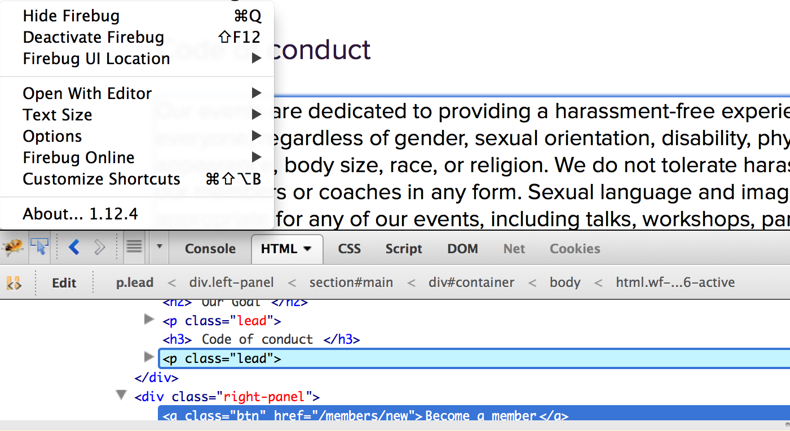

##  HTML AND CSS - Beyond the basics

### Recap

In the previous two lessons, we spoke about **H**yper **T**ext **M**arkup **L**anguage and **C**ascading **S**tyle **S**heets. **HTML** defines the _structure_ of a website and **CSS** the _presentation_.

### Today we will be building a styled website from scratch

The page we will be building will look similar to this [example page]( http://codebar.github.io/tutorials/html/3/example.html "Ada Lovelace")

We will also be explaining in more detail elements that we mentioned in our previous lesson.

## But before we start...

### Inspectors

Inspectors are development tools that help you view, edit and debug CSS, HTML and Javascript.

Some popular inspectors are [firebug](http://getfirebug.com/) if you are using Firefox. Chrome has a build in inspector, but we do suggest you use firebug as it is much easier to use and change different properties with it.



>  Ask your coach to show you how to edit the styling on our example page using firebug

### Required files

Download the files required to start with this tutorial from [here](https://gist.github.com/despo/7328342/download)

## Getting started

Let's begin from the head of our page and set the title like we learned in the first lesson.

```html
<title>Ada Lovelace</title>
```

## Structuring content

We will separate our page in three different areas. The **header**, where our title and picture, the head of our page, will be, the **container** where we will be specifying the main content, and the **footer**.

```html
<header>

</header>
<div id="container">

</div>
<footer>

</footer>
```

> Did you remember to insert these tags within the <body> of your page?

