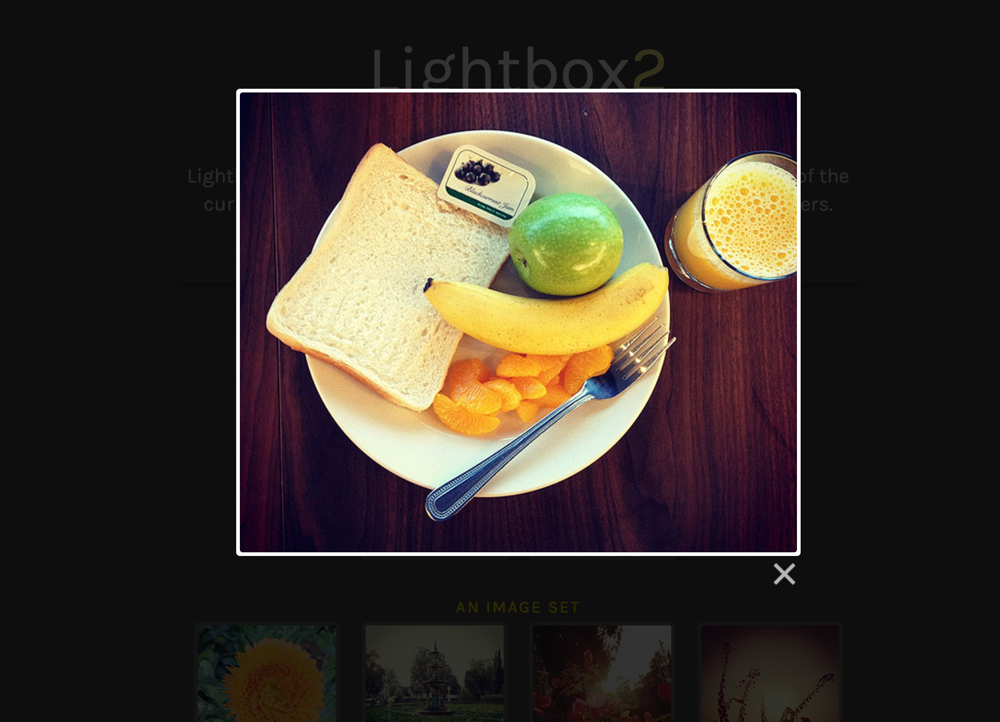

## What is JavaScript?

**JavaScript** is a language that allows for interaction with the user, controlling the content of the browser, and altering the displayed document content.

Some common usages around the web is

#### [Lightboxes](http://lokeshdhakar.com/projects/lightbox2/#example)



#### [Data visualisations](http://www.nytimes.com/interactive/2013/04/08/business/global/asia-map.html?_r=0)


#### Many other of cool stuff!

[The interactive ear](http://www.amplifon.co.uk/interactive-ear/index.html)


[Stack of cards](http://designlovr.com/examples/dynamic_stack_of_index_cards/)


[Games](http://gorillas.heroku.com)


### Today we will be focusing on understanding the basics

## But before we start...

### Required files

Download the files required to begin working through the tutorial from [here](https://gist.github.com/despo/0b674ec9d5ae9cb09704/download)

## Let's try out some JavaScript!

We'll start by just outputting some content on our browsr's inspector console.
To keep track of what we do, you should write the code in the `script.js`

First open up your HTML page and the **inspector**.

> We will be doing a lot of refreshing to see our changes! **JavaScript** loads when the page opens, so it's essential to refresh!

Let's write out something in the console, to make sure that our file is in place and working!

```js
console.log("Hello! This is my first line of Javascript!");
```

##Variables and Expressions

### What are Variables?

Variables are objects that hold content. They are declared using `var` and we can assign values to them.

### What are expressions?

Expressions are a set of variables, operations and expressions that get evaluated together.


#### Let's try and understand variables by building some simple expressions

There are different types of variables that we can declare:

Try them out one by one!

- **strings** - group of characters, it must always be in quotes

```js
var name = "Codebar";

console.log(name + "is amazing!"); // this is an expression
```

> Can you see the output in your console? Try changing the value of `name`

- **numbers**

Let's output the value of pi.

```js
var pi = 3.14;

console.log("The value of pi: " + pi);
```

Now let's output the current year, and autocalculate the value of the next year using **addition**

```js
var year = 2013;
var nextYear = year + 1;

console.log("We are in " + year +", but " + nextYear + " is just around the corner!");
```

That's great! We can combine strings together and add up numbers.

> Is something not working? In JavaScript you must make sure to end every line with a *;*

- **booleans** - true/false

```js
var codebarIsAwesome = true;
var weatherIsAmazing = false;

console.log("Is Codebar AWESOME? " + codebarIsAwesome);
console.log("Is the weather in London amazing? " + weatherIsAmazing);
```

- **undefined variables**
If no value is set for a variable, then it won't have a type until you set it.

```js
var iDontHaveAValue;

console.log("What kind of variable am I? " + iDontHaveAValue);
```

### Operations
The are are a number of operations you can apply, just like when using math.

Let's section the output by outputing a title

```js
console.log("Operations");

```

#### addition  `+`

```js
var x = 6;
var y = 3;
var addition = x + y;

console.log("Addition: x+y=" + addition);
```

#### subtraction `-`

```js
var subtraction = x - y;

console.log("Subtraction: x-y=" + subtraction);
```

#### Multiplication `*`

```js
var multiplication = x * y;

console.log("Multiplication: x*y=" + multiplication);
```

#### Division `/`

```js
var division = x / y;

console.log("Division: x/y=" + division);
```

### The if statement
In Javascript we can write conditions to control what we output

Let's try this out.

```
if (codebarIsAwesome) {
  console.log("Codebar is AWESOME!");
}
```

Isn't that cool! :)

We can also write a condition that checks for the opposite, so, not true

```js
if (!codebarIsAwesome) {
  console.log("Codebar is not so awesome :(!");
}
```

> This should  not output anything. Try setting `codebarIsAwesome` to false before running this expression.

> Did you use `var`? Since we have already declared our variable, you shouldn't need to do that.


Conditions work with a number of evaluated statements. Some of the comparisons we can use are

#### Equality `==`

```js
var apples = "apples";
var oranges = "oranges";

if (apples == oranges) {
  console.log("Apples and Oranges are the same thing!");
}
```

This should not output anything, **apples** and **oranges** are not the same thing!

#### Inequality `!=`

```js
if (apples != oranges) {
  console.log("Apples are not Oranges!");
}
```

#### Greater than `>`

```js
var coaches = 20;
var students = 24;
var pizzas = 25;

var people = coaches + students;

if (people > pizzas) {
  console.log("We have more people than pizzas!");
};

if (students > pizzas) {
  console.log("But we have more students than pizzas! Let's not give the coaches any food.");
};
```

#### Less than `<`

```js
if (coaches < students) {
  console.log("We have less coaches than students.");
}
```

### If Else statements

An **if else** statement enables us to run alternative actions when our condition is not true

```js
if (people > pizzas) {
  console.log("We have more people than pizzas. That's not very good :/");
} else {
  console.log("We have waaay too much pizza. That can never be bad! :)");
}

```

> Try changing the numbers. What happen when you set students to `2`. Do you see the else part of the statement being evaluated?

## Functions

Functions are a major part of every programming language. They enable us to create meaningul snippets of code that we can rerun without having to define the same things again.

Let's write a small function that prompts someone accessing our page with a message.

Let's to this in steps. First create a function:

```js
function hello() {
 console.log("Hello!");
}
```

If you refresh the browser, you will notice that nothing is outputted. This is because we must call our function in order for it to be evaluates and give us a result.

```js
hello();
```

Now let's extend out function to take in **arguments**. We want it to say hello to different people.

```js
function hello(name) {
 console.log("Hello " + name + "!");
};
```

If you now run `hello();` you will notice that it says "Hello undefined".

>  Why is that? Do you know? Have a look at **undefined variables*** if you don't remember

Ok, so let's call the function with our name.

```js
hello("Codebar");
```

> Call the function with your name and your coach's name. Do you see the output?


Let's write an improved version of this that shows a small dialog with the message.

> We'll only give you a part of the function, try to make this work.

```js
function popupHello() {
  alert("Hello " + name);
}
```

Now that you fixed the problem, call the function from you browser's console!

> Don't add the call to the function in your `script.js`(It will get annoying to see it ever time you refresh!)

### Multiple arguments

So far we've tried out functions with no and one argument. But noone limits how many we can use.
Let's try writing a function with multiple arguments.

```js
function whatIAmDoingToday(coach, place) {
 console.log("Today, I am at " + place + " and I am learning a bit of JavaScript with the help of " + coach);
}
```


### Returning values

Besides outputing, which is nice when learning as it makes it easier to see the result, we can also `return` values.

Create a function that adds two numbers together

```js
function addNumbers(x, y) {
  x + y;
}
```
> Try to run this. Not what you expected is it?

To fix this, we must explicitly use `return` when we want the function to give us back the result

Change the function to

```js
return x+y;
```

> Anything after the return will be ignored. What happens when you add some content before the end of your function but after defining `return`?

We can also call functions, from functions. What do you expect to get when running `addNumbers(addNumbers(1,2), 4);`? Try it out.

### Scope

When we declare variable within a function, they are not visible outside it.

```js
function subtractNumbers(x,y) {
  var result = x-y;
  return result;
}

subtractNumbers(10,3);
console.log(result);
```

But, when we declare them outside the function, they are

```js
var result;
function subtractNumbers(x,y) {
  result = x-y;
  return result;
}

subtractNumbers(10,3);
console.log(result);
```

## Bonus
Now you know enough to write your own little **JavaScript** program!

With help from your coach try and write a program to do the following
- Store your name in a variable

- Store information about yourself in a variable

- Store how many codebar sessions you have attended

- Make the program output
  ```
  Hi! My name is _name_.
  A couple of things about me _about you_.
  I have attended _number of sessions_ Codebar sessions so far!
  ```

- if the number of sessions attended is 0
  ```
  This is the first time I'm attending Codebar!
  ```
- If the number of sessions attended is more than 0
  ```
  This is not my first time here. I <3 Codebar!
  ```

---
This ends our **Introduction to JavaScript**. Is there something you don't understand? Try and go through the provided resources with your coach. If you have any feedback, or can think of ways to improve this tutorial [send us an email](mailto:feedback@codebar.io) and let us know.


