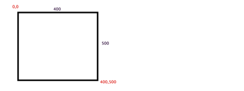
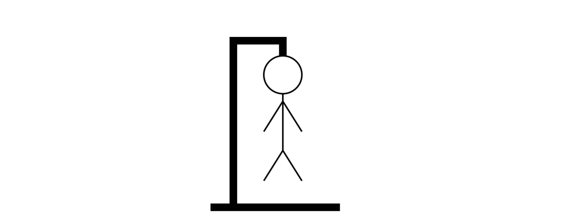

## Todays lesson

In this lesson we will be going over the **`<canvas>`** HTML element.

Canvas is used to draw graphics using JavaScript. It has a number of methods for drawing circles, boxes, text and adding images.

## Before we begin

[Download](https://gist.github.com/despo/e4770ca5afeaf70c23bc/download) a canvas playground to practise the examples.

## Canvas

Canvas is specified using the HTML `<canvas>` element.

```html
<canvas id="canvas-id" width="400" height="500"> </canvas>
```

> Have a look in the `index.html`. Can you see the canvas definition?

## JavaScript

To render to the canvas, we must use the canvas drawing context, which handles all the nice stuff.

```js
var canvas = document.getElementById('canvas-id');
var context = canvas.getContext("2d");
```

### Controls

Depending on if we are filling up a shape, or just drawing the outline, we can use `fillStyle` or `strokeStyle`to set the color of the element.

```js
  context.fillStyle = "yellow";
  context.strokeStyle = "purple";
```

To set the line width:

```js
  context.lineWidth = "3";
```

#### Drawing

Before we move on to drawing, let's try and understand how canvas is laid out.



The upper left corned for the canvas is (0,0) and the lower right (400,500), as our canvas is 400x500.

Let's place a rectangle 100 px away from the top left corner of the canvas.

```
context.fillRect(100, 100, 50, 100);
```
> Did you make sure you set the color using `context.fillStyle` before running this?

Now let's add another rectangle, but this time only its outline.

```
context.strokeRect(400, 100, 50, 100);
```

**Bonus** Add a new rectangle outline with dimensions **120x150** at the bottom right of the screen, with **line width** 1

### Reseting canvas

To reset the canvas, all you have to do is sets its width. You don't even need to change the value so you can just do

```javascript
canvas.width = canvas.width;
```

**Exercise**

Create a reset() function that reset the canvas, and call it when the Reset button is being clicked.

### Drawing paths

Let's draw a line going from the middle left to the bottom right corner of the canvas.

```javascript
context.moveTo(0,300);
context.lineTo(400,500);
```

This won't do anything until we call the `stroke()`, which deals with the painting.

You can also draw an join multiple paths together. Let's create a rectange with corners at (0, 0), (0, 200), (200, 300) and (200, 0).

```javascript
context.beginPath();

context.lineWidth = 1;
context.strokeStyle = "purple";

context.moveTo(0,0);
context.lineTo(0,200);
context.lineTo(200,200);
context.lineTo(200,0);
context.lineTo(0,0);

context.stroke();
```

## Drawing circles

To draw circles, you can use the `arc` method. `arc(x, y, radius, staging_angle, endingAngle, counterClockwise)`

```javascript
context.beginPath();
context.arc(200, 100, 50, 0, Math.PI*2, true);
context.closePath();
context.lineWidth = 4;
context.stroke();
```

To fill in the circle, or any other joined elements, we use the `fill()` method after closing the path.

**Exercise** Create another circle and fill it with the color blue.

##Transformations

In canvas, we can also use transofrmations on the current matrix.

###`rotate()`

First add the rotate method at the bottom of the `draw()` method.

```javascript
context.rotate(10*Math.PI/180);
```
If you try pressing the **Draw** button more than once, you will notice that everything keeps being at a rotated angle after the first time.

To avoid this, when calling any transformation we must save and then restore the state of the canvas.

```javascript
context.save()
context.rotate(10*Math.PI/180);

// rotated changes

context.restore()
```

###`translate()`

Translate moves the current position. If we are at 10, 10 and we `translate(20, 15)`, then our new position is 30, 45.

```javascript
context.translate(45, 45);
```

###`scale()`

And finally, `scale(scaleWidth, scalewHeight)`. Scale changes the dimensions of the rendered items.


```javascript
context.scale(2,2);
```

> Try tweaking the scale properties. How can you make the shape 5 times bigger?

##Exercise - Drawing Hangman!



[Download](https://gist.github.com/despo/0dc7c874efa544475d66/download) the required files for this exercise or clone them directly from github `git clone https://gist.github.com/despo/0dc7c874efa544475d66.git`

Using what we've learned today, draw Hangman in Canvas.

We have already created the functions to draw the individual parts, so you should be able to create the functions, uncomment them and see hangman being drawn.

> Use pen and paper to think about the position of each element. You already know that the top left is 0,0 and the bottom right 400, 500. Use a grid if you are finding it hard.


> Don't forget `beginPath()` and `stroke()` before and after drawing elements.

Here is our version of [Hangman in Canvas](../../examples/canvas-hangman/index.html).

##Bonus

Plug hangman in the game you created in the last session. You can use conditional statements to control when each part is drawn.


---
This ends our **Drawing in Canvas** tutorial. Is there something you don't understand? Try and go through the provided resources with your coach. If you have any feedback, or can think of ways to improve this tutorial [send us an email](mailto:feedback@codebar.io) and let us know.

